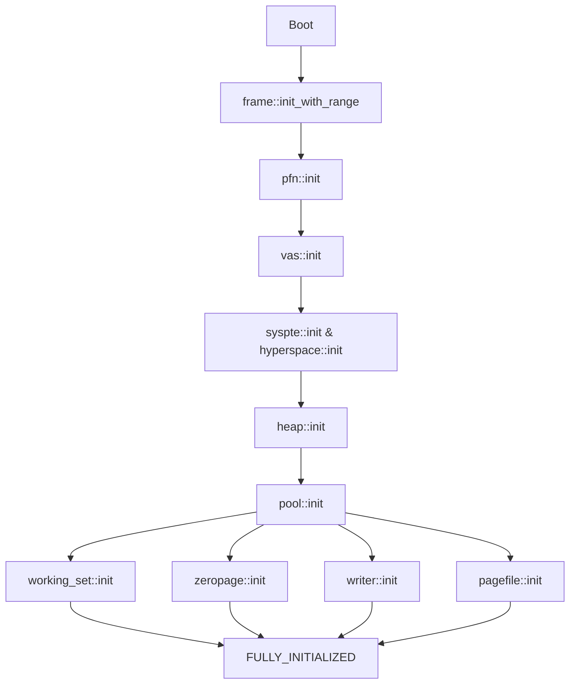

# Memory Manager Initialization Order

This document describes the **mandatory initialization order** for the memory manager subsystems and the dependencies between them.

## Why This Document Exists

**CRITICAL-003**: In September 2026, a critical bug was discovered where `vas::init()` was being called before `pfn::init()`. This caused null pointer dereferences because `vas::init()` calls `pfn::allocate_pfn()` to allocate pages for the self-map page table chain.

To prevent this from happening again, we now enforce the initialization order using:
1. **Runtime state machine** (implemented in `init_state.rs`)
2. **This documentation** (to help developers understand the dependencies)
3. **Future: Type-system enforcement** (planned for next refactor)

## Dependency Graph



## Initialization States

The state machine in `init_state.rs` enforces the following states:

| State | Value | Subsystem | Function |
|-------|-------|-----------|----------|
| UNINITIALIZED | 0 | - | Initial state |
| FRAME_ALLOCATOR | 1 | frame | `frame::init_with_range()` |
| PFN_DATABASE | 2 | pfn | `pfn::init()` |
| VAS_INITIALIZED | 3 | vas | `vas::init()` |
| PTE_SUBSYSTEMS | 4 | syspte, hyperspace | `syspte::init()`, `hyperspace::init()` |
| HEAP_INITIALIZED | 5 | heap | `heap::init()` |
| POOL_INITIALIZED | 6 | pool | `pool::init()` |
| FULLY_INITIALIZED | 7 | - | All subsystems ready |

## Critical Dependencies

### 1. frame::init_with_range() MUST be first

**Why**: All other subsystems need to allocate physical memory.

**Depends on**: Nothing (uses pre-allocated BSS storage)

**Called by**: `mm::init()`

**State transition**: UNINITIALIZED → FRAME_ALLOCATOR

### 2. pfn::init() MUST come before vas::init()

**Why**: `vas::init()` calls `pfn::allocate_pfn()` to get pages for the self-map page table chain.

**Depends on**: frame allocator (to allocate PFN database storage)

**Called by**: `mm::init()`

**State transition**: FRAME_ALLOCATOR → PFN_DATABASE

**History**: This was the bug in CRITICAL-003. The order was reversed, causing crashes.

### 3. vas::init() MUST come before heap::init()

**Why**: `heap::init()` requires virtual address space mapping to be operational.

**Depends on**: PFN database (to allocate page table pages)

**Called by**: `mm::init()`

**State transition**: PFN_DATABASE → VAS_INITIALIZED

### 4. syspte::init() and hyperspace::init() after vas::init()

**Why**: These subsystems need the self-map to be installed.

**Depends on**: VAS (uses self-map for page table access)

**Called by**: `mm::init()`

**State transition**: VAS_INITIALIZED → PTE_SUBSYSTEMS (implied, currently not enforced)

### 5. heap::init() MUST come before pool::init()

**Why**: `pool::init()` may use heap allocations for pool metadata.

**Depends on**: VAS (needs virtual memory mapping)

**Called by**: `mm::init()`

**State transition**: VAS_INITIALIZED → HEAP_INITIALIZED

### 6. pool::init() MUST come before working_set/zeropage/writer/pagefile

**Why**: These subsystems use pool allocations.

**Depends on**: Heap (may use heap for metadata)

**Called by**: `mm::init()`

**State transition**: HEAP_INITIALIZED → POOL_INITIALIZED

## Enforcement Mechanisms

### 1. Runtime State Machine (Current)

Every initialization function calls:
```rust
// Check prerequisite
init_state::require_state(REQUIRED_STATE, "subsystem::init");

// Advance state
init_state::enter_state(NEW_STATE, "subsystem::init");
```

If the order is violated, the kernel bugchecks with diagnostic information.

### 2. Type System Enforcement (Planned)

Future refactor will use the type system to enforce order at compile time:

```rust
let phase0 = MmPhase0::begin();
let phase1 = phase0.init_frame_allocator(base, size);  // Consumes phase0
let phase2 = phase1.init_pfn_database(base_pfn, count);  // Consumes phase1
let phase3 = phase2.init_vas();  // Consumes phase2
// Cannot call phase0.init_vas() anymore - compile error!
```

## Testing

### Unit Tests

See `init_state.rs::tests` for state machine validation tests.

### Integration Tests

Every architecture must pass the boot test:
```bash
# x86_64
qemu-system-x86_64 -kernel nt61-kernel ...

# aarch64
qemu-system-aarch64 -machine virt -kernel nt61-kernel ...

# riscv64
qemu-system-riscv64 -machine virt -kernel nt61-kernel ...
```

If initialization order is wrong, the kernel will bugcheck during boot.

## Debugging Initialization Order Issues

### Symptoms

- Null pointer dereferences during MM initialization
- Page faults in early boot
- Bugcheck 0xDEAD_0001 (MM_INITIALIZATION_ORDER_VIOLATION)
- Bugcheck 0xDEAD_0002 (MM_INITIALIZATION_STATE_SKIP)

### Diagnostic Information

When a state violation occurs, the serial output shows:

```
[MM-FATAL] INITIALIZATION ORDER VIOLATION
Operation: vas::init
Current state: FRAME_ALLOCATOR
Required state: PFN_DATABASE

BUGCHECK 0xDEAD0001
P1: 1 (current state)
P2: 2 (required state)
P3: <address of "vas::init" string>
P4: 0
```

### How to Fix

1. Check the dependency graph above
2. Ensure prerequisites are initialized first
3. Add the required `require_state()` call if missing
4. Verify the `enter_state()` call is in the right place

## Cross-Architecture Considerations

### x86_64

Full state machine enforcement. All tests pass.

### aarch64

The self-map implementation differs from x86_64. Ensure:
- `vas::init()` still requires PFN database
- Identity mapping is set up before heap::init()

### riscv64

Similar considerations to aarch64.

### loongarch64

Less mature. Extra care needed during bring-up.

## Related Files

- `nt61/src/mm/init_state.rs` - State machine implementation
- `nt61/src/mm/mod.rs` - MM initialization orchestration
- `nt61/src/mm/frame.rs` - Frame allocator
- `nt61/src/mm/pfn.rs` - PFN database
- `nt61/src/mm/vas.rs` - Virtual address space
- `nt61/src/mm/heap.rs` - Kernel heap
- `nt61/src/mm/pool.rs` - Kernel pool

## Version History

- **2026-09-18**: Created after fixing CRITICAL-003
- **2026-09-17**: CRITICAL-003 discovered (vas before pfn)
- **2026-09-18**: State machine enforcement added

## Future Work

1. Implement type-system enforcement (compile-time)
2. Add more granular states for syspte/hyperspace
3. Extend to other subsystems (ke, io, etc.)
4. Add visualization tools for initialization trace

---

**If you are modifying MM initialization order, you MUST update this document and the state machine in `init_state.rs`.**
